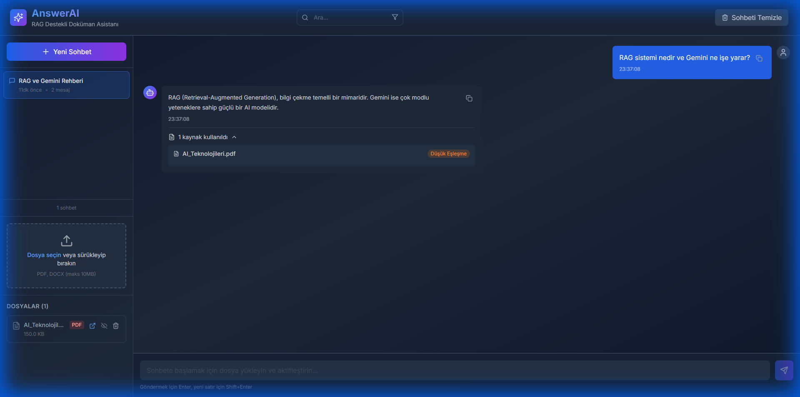

# AnswerAI - Gelişmiş RAG Chatbot 🤖

React, Gemini AI ve modern web teknolojileri ile geliştirilmiş; konuşma hafızası, dosya kalıcılığı ve çoklu belge karşılaştırma yeteneklerine sahip modern bir RAG (Retrieval-Augmented Generation) chatbot.


## 🎥 Uygulama Tanıtımı

Uygulamanın özelliklerini gösteren arayüz görünümü:



*Modern arayüz: PDF yükleme, RAG chatbot ile soru-cevap, kaynak gösterimi ve gelişmiş arama özellikleri*


## ✨ Özellikler

### 📄 Belge Yönetimi
- **PDF ve DOCX Desteği**: Birden fazla format desteği (maks 10MB)
- **IndexedDB Kalıcılığı**: Dosyalar tarayıcı veritabanında saklanır, sayfa kapansa bile kalır
- **Vektör Veritabanı**: İşlenmiş metinler ve vektörler yerel ChromaDB sunucusunda saklanır
- **Çoklu Dosya**: Aynı anda birden fazla belge yükleyin ve yönetin
- **Aktif/Pasif Kontrolü**: Hangi belgelerin sohbete dahil edileceğini seçin
- **Dosya Detayları**: Sayfa sayısı, boyut, yükleme tarihi

### 💬 Konuşma Özellikleri
- **IndexedDB Depolama**: Tüm sohbetler güvenli ve hızlı depolanır
- **Kalıcı Geçmiş**: Tarayıcı kapansa bile konuşmalar kaybolmaz
- **Otomatik Başlıklandırma**: İlk mesaja göre akıllı başlık oluşturma
- **Sohbet Yönetimi**: Yeniden adlandırma, silme, geçiş yapma
- **Hızlı Geçiş**: Kayıtlı konuşmalar arasında anında geçiş

### 🔍 Gelişmiş RAG Yetenekleri
- **Semantik Arama**: Gemini embedding'leri ile vektör benzerlik araması
- **Gelişmiş Geri Çağırma (6 Metot)**: Naive, MMR, HyDE, BM25 Hybrid, Self-RAG ve GraphRAG desteği
- **Çoklu Belge Soru-Cevap**: Birden fazla PDF üzerinden soru sorun
- **Belge Karşılaştırma**: Akıllı karşılaştırma yetenekleri
- **Kaynak Gösterimi**: Cevabın hangi belgeden ve sayfa numarasından geldiğini görün
- **Chunk Caching**: İşlenmiş chunk'lar IndexedDB'de saklanır

### 🧠 Desteklenen RAG Yöntemleri
Uygulama, farklı kullanım senaryoları için 6 farklı gelişmiş geri çağırma (retrieval) yöntemini destekler:

1. **🔍 Naive Dense Retrieval**: Temel vektör benzerlik araması. Sorgu embedding'i hesaplanır ve en yakın chunk'lar cosine benzerliğiyle bulunur. En hızlı yöntemdir.
2. **🧩 MMR (Maximal Marginal Relevance)**: Alakalı VE çeşitli sonuçlar döndürür. Benzer chunk'ların tekrarını önleyerek daha kapsamlı bir bağlam oluşturur.
3. **💭 HyDE (Hypothetical Document Embedding)**: AI, önce soruya cevap veren varsayımsal bir belge üretir. Bu belgenin embedding'i gerçek chunk'larla eşleştirilir. Beklenmedik eşleşmeler için idealdir.
4. **⚖️ BM25 Hybrid Search**: Anlamsal vektör aramasını geleneksel anahtar kelime eşleşmesiyle birleştirir. Teknik terimlerin ve özel isimlerin önemli olduğu durumlarda en iyi sonuçları verir.
5. **🤔 Self-RAG**: AI, her aday chunk'ı "Bu soruyla ne kadar alakalı?" diye kendi kendine puanlar. Düşük puanlı (DÜŞÜK) chunk'lar elenir, en kaliteli bağlam seçilir.
6. **🕸️ GraphRAG**: Chunk'lar arasında anlamsal bir ilişki grafı kurar. Sorguyla alakalı bir noktadan başlayarak komşu (ilişkili) chunk'lara BFS (Breadth-First Search) ile yayılır; bağlantılı bilgileri birleştirir.

### 🔎 Gelişmiş Arama
- **Konuşma Araması**: Tüm sohbet geçmişinde anahtar kelime arama
- **Mesaj Vurgulama**: Bulunan sonuçlar vurgulanır ve otomatik scroll
- **Filtreleme**: Tarih aralığı, konuşma, mesaj tipi filtreleri
- **Önbellek Sistemi**: Hızlı arama sonuçları

### ⚙️ Ayarlar Yönetimi
- **UI Üzerinden API Key**: Ayarlar panelinden kolayca API anahtarı girilebilir
- **Chunk Boyutu Ayarı**: RAG performansını optimize edebilirsiniz
- **Örtüşme (Overlap) Kontrolü**: Chunk'lar arası örtüşme ayarlanabilir
- **Benzerlik Eşiği**: Minimum benzerlik skoru ayarlanabilir

### 🎨 Modern Kullanıcı Deneyimi (UX)
- **Glassmorphism**: Modern ve şık arayüz tasarımı
- **Responsive**: Mobil, tablet ve masaüstü uyumlu
- **Lazy Loading**: PDF ve DOCX görüntüleyiciler ihtiyaç anında yüklenir
- **Error Boundaries**: Hata yönetimi ve kullanıcı dostu mesajlar
- **Toast Bildirimleri**: Kullanıcı dostu bildirim sistemi
- **Markdown Desteği**: AI cevaplarında zengin metin biçimlendirmesi
- **Syntax Highlighting**: Kod bloklarında renkli gösterim

## 🚀 Hızlı Başlangıç

### Gereksinimler

- Node.js 18+ yüklü olmalı
- Python 3.8+ (ChromaDB için) yüklü olmalı
- Google Gemini API anahtarı ([Buradan alabilirsiniz](https://aistudio.google.com/apikey))

### Kurulum

1. **Projeyi klonlayın**
   ```bash
   git clone https://github.com/Llein1/AnswerAI-Local.git
   cd AnswerAI-Local
   ```

2. **Bağımlılıkları yükleyin**
   ```bash
   npm install
   ```

3. **ChromaDB Vektör Sunucusunu başlatın**
   ```bash
   pip install chromadb
   chroma run --host localhost --port 8000
   ```

4. **Farklı bir terminalde geliştirme sunucusunu başlatın**
   ```bash
   npm run dev
   ```

5. **Tarayıcınızda ayarlara gidin**
   - `http://localhost:5173` adresine gidin
   - Sağ üst köşedeki **⚙️ Ayarlar** butonuna tıklayın
   - Gemini API anahtarınızı girin
   - Kaydedin ve kullanmaya başlayın!

> 💡 **Not**: API anahtarı artık UI üzerinden giriliyor, `.env` dosyası opsiyonel.

## 📖 Kullanım Rehberi

### 🎯 Adım 1: API Anahtarı Ayarlama

1. Sağ üstten **⚙️ Ayarlar** butonuna tıklayın
2. **Gemini API Key** alanına anahtarınızı yapıştırın
3. İsteğe bağlı: Chunk boyutu ve benzerlik eşiği ayarlayın
4. **Kaydet** butonuna tıklayın

### 📄 Adım 2: Belge Yükleme

1. Sol paneldeki **"Dosya seçin veya sürükleyip bırakın"** alanını kullanın
2. PDF veya DOCX dosyanızı seçin (maks 10MB)
3. Dosya yüklendikten sonra otomatik işlenir ve IndexedDB'ye kaydedilir

### 💬 Adım 3: Soru Sorma

1. Yüklenen belgenin **göz ikonu** aktif olduğundan emin olun
2. Alt kısımdaki sohbet kutusuna sorunuzu yazın
3. Enter tuşuna basın veya gönder butonuna tıklayın

**Örnek Sorular:**
```
- "Bu belge ne hakkında?"
- "X konusunda neler söyleniyor?"
- "Y ve Z arasındaki ilişki nedir?"
```

### 📚 Adım 4: Kaynak Referanslarını İnceleme

1. AI cevabının altındaki **"X kaynak kullanıldı"** yazısına tıklayın
2. Her kaynak için dosya adı, sayfa numarası ve benzerlik skoru görüntülenir

### 🔍 Adım 5: Konuşma Arama

1. Üst kısımdaki **arama kutusunu** kullanın
2. Aramak istediğiniz kelimeyi yazın
3. Sonuçlara tıklayarak o mesaja gidin

### 🔄 Adım 6: Çoklu Belge Karşılaştırma

1. **2 veya daha fazla dosya** yükleyin
2. Her belgenin **göz ikonunu** aktif edin
3. Karşılaştırma soruları sorun:
   ```
   - "Bu iki belge arasındaki farklar neler?"
   - "Hangi belgede X konusu daha detaylı?"
   ```

## 🛠️ Kullanılan Teknolojiler

| Kategori | Teknoloji |
|----------|-----------|
| **Frontend** | React 18 + Vite |
| **Stil** | Tailwind CSS |
| **Meta Veritabanı** | IndexedDB (Dexie.js) |
| **Vektör Veritabanı** | ChromaDB |
| **PDF İşleme** | PDF.js (Mozilla) |
| **DOCX İşleme** | Mammoth.js |
| **AI/LLM** | Google Gemini (Ayarlardan model seçilebilir) |
| **Embeddings** | gemini-embedding-100 |
| **RAG Pipeline** | LangChain + Özel vektör arama |
| **State Yönetimi** | React Hooks |
| **İkonlar** | Lucide React |
| **Markdown** | React Markdown + Syntax Highlighter |

## 📁 Proje Yapısı

```
AnswerAI/
├── src/
│   ├── components/
│   │   ├── Layout.jsx              # Ana düzen
│   │   ├── Header.jsx              # Sabit başlık + arama
│   │   ├── FileUpload.jsx          # Dosya yükleme
│   │   ├── FileList.jsx            # Dosya listesi
│   │   ├── ChatInterface.jsx       # Mesaj alanı
│   │   ├── ChatInput.jsx           # Mesaj giriş
│   │   ├── ConversationList.jsx    # Sohbet listesi
│   │   ├── Settings.jsx            # Ayarlar modalı
│   │   ├── SearchResults.jsx       # Arama sonuçları
│   │   ├── PDFViewer.jsx           # PDF önizleme (lazy)
│   │   ├── DOCXViewer.jsx          # DOCX önizleme (lazy)
│   │   ├── ErrorBoundary.jsx       # Hata yönetimi
│   │   └── ToastContainer.jsx      # Bildirimler
│   ├── services/
│   │   ├── indexedDBService.js     # IndexedDB yönetimi
│   │   ├── fileProcessingService.js # Dosya işleme
│   │   ├── fileStorage.js          # Dosya depolama
│   │   ├── conversationStorage.js  # Sohbet depolama
│   │   ├── settingsStorage.js      # Ayarlar depolama
│   │   ├── geminiService.js        # Gemini API
│   │   ├── chromaDBService.js      # ChromaDB REST istemcisi
│   │   ├── ragService.js           # RAG + vektör arama
│   │   ├── searchService.js        # Arama servisi
│   │   └── chunkCacheService.js    # Chunk önbellekleme
│   ├── hooks/
│   │   └── useToast.jsx            # Toast hook
│   ├── App.jsx                     # Ana uygulama
│   ├── main.jsx                    # Giriş noktası
│   └── index.css                   # Global stiller
├── vite.config.js                  # Vite yapılandırması
├── package.json                    # Bağımlılıklar
└── README.md                       # Bu dosya
```

## 🔧 Yapılandırma

### Ayarlar Paneli

Tüm ayarlar artık **UI üzerinden** yapılandırılıyor:

- **API Anahtarı**: Gemini API anahtarınız
- **Chunk Boyutu**: Varsayılan 1000 karakter
- **Örtüşme (Overlap)**: Varsayılan 200 karakter
- **Benzerlik Eşiği**: Varsayılan 0.4 (0-1 arası)

## 🔒 Güvenlik ve Gizlilik

**AnswerAI tamamen client-side çalışır:**

- ✅ **API Anahtarları**: Sadece tarayıcınızın localStorage'ında saklanır
- ✅ **Veri Gizliliği**: Tüm veriler (dosyalar, sohbetler) IndexedDB'de yerel olarak tutulur
- ✅ **BYOK Modeli**: Her kullanıcı kendi API anahtarını kullanır
- ⚠️ **Önemli**: Halka açık bilgisayarlarda kullanırken tarayıcı verilerini temizleyin

## 💾 Veri Yönetimi

### Veri Depolama Yapısı

- **Dosyalar (Metadata)**: IndexedDB `files` tablosunda
- **Vektörler (Embeddings)**: Yerel ChromaDB sunucusunda (`http://localhost:8000`)
- **Konuşmalar**: IndexedDB `conversations` tablosunda
- **Ayarlar**: `localStorage` üzerinde saklanır

### Verileri Temizleme

Tarayıcı Developer Tools (F12) → Application/Storage:
```javascript
localStorage.clear()
indexedDB.deleteDatabase('AnswerAI')
location.reload()
```

## 🆘 Sorun Giderme

### "API key not configured" hatası
- Ayarlar panelinden API anahtarınızı girin
- Sayfayı yenileyin

### Dosya yükleme hatası
- Dosyanın geçerli PDF/DOCX olduğunu kontrol edin
- Boyutun 10MB altında olduğunu doğrulayın
- IndexedDB kotasını kontrol edin (Settings'ten)

### "QuotaExceededError"
- IndexedDB kotası dolu
- Eski dosyaları silin
- Tarayıcı ayarlarından daha fazla alan verin

### Yavaş cevap süreleri
- İnternet bağlantınızı kontrol edin
- Chunk boyutunu ayarlayın (Settings)
- Aktif dosya sayısını azaltın

### Build hatası
- `node_modules` silin ve `npm install` yapın
- Node.js 18+ olduğunu kontrol edin
- Cache temizleme: `npm run build -- --force`


