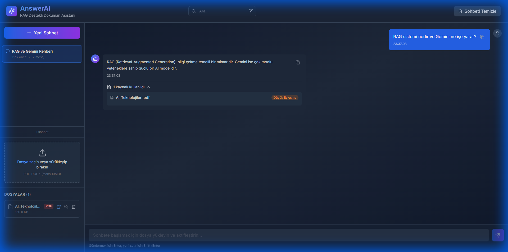

# AnswerAI - Gelişmiş RAG Chatbot 🤖

React, Ollama ve modern web teknolojileri ile geliştirilmiş; konuşma hafızası, dosya kalıcılığı ve gelişmiş RAG yeteneklerine sahip tamamen **yerel (local)** çalışan modern bir RAG chatbot.

## 🎥 Uygulama Tanıtımı

Uygulamanın özelliklerini gösteren arayüz görünümü:



*Modern arayüz: PDF yükleme, RAG chatbot ile soru-cevap, kaynak gösterimi ve gelişmiş arama özellikleri*


## ✨ Özellikler

### 📄 Belge Yönetimi
- **PDF ve DOCX Desteği**: Birden fazla format desteği (maks 25MB)
- **IndexedDB Kalıcılığı**: Dosyalar tarayıcı veritabanında saklanır, sayfa kapansa bile kalır
- **Vektör Veritabanı**: İşlenmiş metinler ve vektörler yerel ChromaDB sunucusunda saklanır
- **Çoklu Dosya**: Aynı anda birden fazla belge yükleyin ve yönetin
- **Aktif/Pasif Kontrolü**: Hangi belgelerin sohbete dahil edileceğini seçin
- **Dosya Detayları**: Sayfa sayısı, boyut, yükleme tarihi

### 💬 Konuşma Özellikleri
- **IndexedDB Depolama**: Tüm sohbetler güvenli ve hızlı depolanır
- **Kalıcı Geçmiş**: Tarayıcı kapansa bile konuşmalar kaybolmaz
- **Otomatik Başlıklandırma**: İlk mesaja göre akıllı başlık oluşturma
- **Sohbet Yönetimi**: Yeniden adlandırma, silme, geçiş yapma

### 🔍 Gelişmiş RAG Yetenekleri
- **Semantik Arama**: Ollama embedding'leri ile vektör benzerlik araması
- **Gelişmiş Geri Çağırma (6 Metot)**: Naive, MMR, HyDE, BM25 Hybrid, Self-RAG ve GraphRAG desteği
- **Kaynak Gösterimi**: Cevabın hangi belgeden ve sayfa numarasından geldiğini görün
- **Chunk Caching**: İşlenmiş chunk'lar IndexedDB'de saklanır

### 🧠 Desteklenen RAG Yöntemleri

1. **🔍 Naive Dense Retrieval**: Temel vektör benzerlik araması. En hızlı yöntemdir.
2. **🧩 MMR (Maximal Marginal Relevance)**: Alakalı VE çeşitli sonuçlar döndürür.
3. **💭 HyDE (Hypothetical Document Embedding)**: AI, önce varsayımsal bir belge üretir; bu embedding gerçek chunk'larla eşleştirilir.
4. **⚖️ BM25 Hybrid Search**: Anlamsal vektör aramasını anahtar kelime eşleşmesiyle birleştirir.
5. **🤔 Self-RAG**: AI, her chunk'ı kendi kendine değerlendirir ve düşük puanlıları eler.
6. **🕸️ GraphRAG**: Chunk'lar arasında anlamsal bir ilişki grafı kurarak BFS ile yayılır.

### 🔎 Gelişmiş Arama
- **Konuşma Araması**: Tüm sohbet geçmişinde anahtar kelime arama
- **Mesaj Vurgulama**: Bulunan sonuçlar vurgulanır ve otomatik scroll

### ⚙️ Ayarlar Yönetimi
- **Ollama LLM Model Seçimi**: Ayarlar panelinden model seçilebilir
- **Chunk Boyutu Ayarı**: RAG performansını optimize edebilirsiniz
- **Benzerlik Eşiği**: Minimum benzerlik skoru ayarlanabilir

### 🎨 Modern Kullanıcı Deneyimi (UX)
- **Glassmorphism**: Modern ve şık arayüz tasarımı
- **Responsive**: Mobil, tablet ve masaüstü uyumlu
- **Lazy Loading**: PDF ve DOCX görüntüleyiciler ihtiyaç anında yüklenir
- **Toast Bildirimleri**: Kullanıcı dostu bildirim sistemi
- **Markdown Desteği**: AI cevaplarında zengin metin biçimlendirmesi

## 🚀 Hızlı Başlangıç

### Gereksinimler

- Node.js 18+ yüklü olmalı
- Python 3.8+ (ChromaDB için) yüklü olmalı
- [Ollama](https://ollama.ai) yüklü olmalı

### Kurulum

1. **Projeyi klonlayın**
   ```bash
   git clone https://github.com/Llein1/AnswerAI-Local.git
   cd AnswerAI-Local
   ```

2. **Bağımlılıkları yükleyin**
   ```bash
   npm install
   ```

3. **Ollama modellerini indirin**
   ```bash
   # LLM modeli (varsayılan)
   ollama pull gemma4:e2b-it-q4_K_M

   # Embedding modeli
   ollama pull qwen3-embedding:8b-q4_K_M
   ```

4. **Ollama sunucusunu başlatın**
   ```bash
   ollama serve
   ```

5. **ChromaDB Vektör Sunucusunu başlatın** (yeni terminal)
   ```bash
   pip install chromadb
   chroma run --path ./chroma_data --host localhost --port 8000
   ```

6. **Geliştirme sunucusunu başlatın** (yeni terminal)
   ```bash
   npm run dev
   ```

7. **Tarayıcınızda açın**
   - `http://localhost:5173` adresine gidin
   - Sağ üst köşedeki **⚙️ Ayarlar** butonuna tıklayın
   - Ollama bağlantısını test edin ve kullanmaya başlayın!

> 💡 **Not**: Artık API anahtarı gerekmez. Tüm işlemler yerel Ollama üzerinden yürütülür.

## 📖 Kullanım Rehberi

### 🎯 Adım 1: Servisleri Başlatın

Her kullanımda şu iki komutu çalıştırmanız yeterlidir:
```bash
# Terminal 1
ollama serve

# Terminal 2
chroma run --path ./chroma_data --host localhost --port 8000
```

### 📄 Adım 2: Belge Yükleme

1. Sol paneldeki **"Dosya seçin veya sürükleyip bırakın"** alanını kullanın
2. PDF veya DOCX dosyanızı seçin (maks 25MB)
3. Dosya yüklendikten sonra otomatik işlenir ve ChromaDB'ye kaydedilir

### 💬 Adım 3: Soru Sorma

1. Yüklenen belgenin **göz ikonu** aktif olduğundan emin olun
2. Alt kısımdaki sohbet kutusuna sorunuzu yazın
3. Enter tuşuna basın veya gönder butonuna tıklayın

## 🛠️ Kullanılan Teknolojiler

| Kategori | Teknoloji |
|----------|-----------|
| **Frontend** | React 18 + Vite |
| **Stil** | Tailwind CSS |
| **Meta Veritabanı** | IndexedDB (Dexie.js) |
| **Vektör Veritabanı** | ChromaDB |
| **PDF İşleme** | PDF.js (Mozilla) |
| **DOCX İşleme** | Mammoth.js |
| **LLM** | Ollama — `gemma4:e2b-it-q4_K_M` (yerel, API gerektirmez) |
| **Embeddings** | Ollama — `qwen3-embedding:8b-q4_K_M` (yerel) |
| **RAG Pipeline** | Özel vektör arama + 6 retrieval yöntemi |
| **State Yönetimi** | React Hooks |
| **İkonlar** | Lucide React |
| **Markdown** | React Markdown + Syntax Highlighter |

## 📁 Proje Yapısı

```
AnswerAI/
├── src/
│   ├── components/
│   │   ├── Layout.jsx              # Ana düzen
│   │   ├── Header.jsx              # Sabit başlık + arama
│   │   ├── FileUpload.jsx          # Dosya yükleme
│   │   ├── FileList.jsx            # Dosya listesi
│   │   ├── ChatInterface.jsx       # Mesaj alanı
│   │   ├── ChatInput.jsx           # Mesaj giriş
│   │   ├── ConversationList.jsx    # Sohbet listesi
│   │   ├── Settings.jsx            # Ayarlar modalı
│   │   ├── SearchResults.jsx       # Arama sonuçları
│   │   ├── PDFViewer.jsx           # PDF önizleme (lazy)
│   │   ├── DOCXViewer.jsx          # DOCX önizleme (lazy)
│   │   ├── ErrorBoundary.jsx       # Hata yönetimi
│   │   └── ToastContainer.jsx      # Bildirimler
│   ├── services/
│   │   ├── indexedDBService.js     # IndexedDB yönetimi
│   │   ├── fileProcessingService.js # Dosya işleme
│   │   ├── fileStorage.js          # Dosya depolama
│   │   ├── conversationStorage.js  # Sohbet depolama
│   │   ├── settingsStorage.js      # Ayarlar depolama
│   │   ├── ollamaLLMService.js     # Ollama LLM (yerel)
│   │   ├── ollamaEmbeddingService.js # Ollama Embedding
│   │   ├── chromaDBService.js      # ChromaDB REST istemcisi
│   │   ├── ragService.js           # RAG + vektör arama
│   │   ├── evaluationService.js    # RAG değerlendirme
│   │   ├── searchService.js        # Arama servisi
│   │   └── chunkCacheService.js    # Chunk önbellekleme
│   ├── hooks/
│   │   └── useToast.jsx            # Toast hook
│   ├── App.jsx                     # Ana uygulama
│   ├── main.jsx                    # Giriş noktası
│   └── index.css                   # Global stiller
├── vite.config.js                  # Vite yapılandırması
├── package.json                    # Bağımlılıklar
└── README.md                       # Bu dosya
```

## 🔧 Yapılandırma

### Ayarlar Paneli

Tüm ayarlar **UI üzerinden** yapılandırılıyor:

- **Ollama LLM Modeli**: `gemma4:e2b-it-q4_K_M` (varsayılan) veya başka bir model
- **Chunk Boyutu**: Varsayılan 1000 karakter
- **Top-K**: Geri alınacak chunk sayısı
- **Benzerlik Eşiği**: Varsayılan 0.3 (0-1 arası)
- **RAG Yöntemi**: 6 farklı retrieval stratejisi

### Desteklenen Ollama Modelleri

| Model | Özellik |
|-------|---------|
| `gemma4:e2b-it-q4_K_M` | Varsayılan — hafif ve hızlı |
| `gemma3:1b` | En hızlı |
| `gemma3:4b` | Dengeli |
| `llama3.2:3b` | Alternatif |
| `qwen2.5:7b` | En güçlü |

## 🔒 Güvenlik ve Gizlilik

**AnswerAI tamamen local çalışır — internet bağlantısı gerekmez:**

- ✅ **Sıfır API Maliyeti**: Tüm LLM ve embedding işlemleri yerel Ollama üzerinde
- ✅ **Veri Gizliliği**: Hiçbir veri dışarı çıkmaz; dosyalar ve sohbetler IndexedDB'de yerel kalır
- ✅ **Çevrimdışı Çalışma**: İnternet bağlantısı olmadan da kullanılabilir

## 💾 Veri Yönetimi

- **Dosyalar (Metadata)**: IndexedDB `files` tablosunda
- **Vektörler (Embeddings)**: Yerel ChromaDB sunucusunda (`http://localhost:8000`)
- **Konuşmalar**: IndexedDB `conversations` tablosunda
- **Ayarlar**: `localStorage` üzerinde saklanır

### Verileri Temizleme

```javascript
localStorage.clear()
indexedDB.deleteDatabase('AnswerAI')
location.reload()
```

## 🆘 Sorun Giderme

### Ollama bağlantı hatası
- `ollama serve` komutunu çalıştırın
- Ayarlar → Ollama → "Test Et" ile bağlantıyı doğrulayın

### "Model bulunamadı" hatası
```bash
ollama pull gemma4:e2b-it-q4_K_M
ollama pull qwen3-embedding:8b-q4_K_M
```

### ChromaDB bağlantı hatası
```bash
pip install chromadb
chroma run --path ./chroma_data --host localhost --port 8000
```

### Dosya yükleme hatası
- Dosyanın geçerli PDF/DOCX olduğunu kontrol edin
- Boyutun 25MB altında olduğunu doğrulayın

### Build hatası
- `node_modules` silin ve `npm install` yapın
- Node.js 18+ olduğunu kontrol edin
